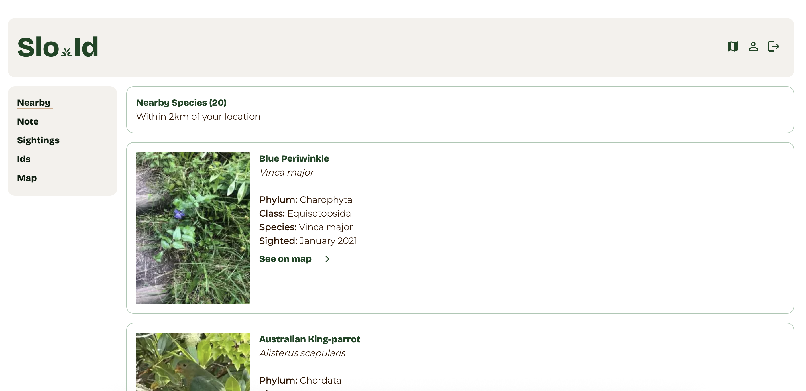

# Slo-id 🌿

A species identification application focused on accurate identification through detailed observation and systematic tracking of sightings.

## Overview

Slo-id emphasises depth over speed in species identification, helping users avoid misidentifications by examining key details and tracking sightings to understand ecological patterns. The app follows a "slow method" approach with a 1-active-draft limit to encourage careful, thorough identification.

## Features

### Species Identification
- **Multiple Taxa Support**: Insects, plants, reptiles, birds, and minerals
- **Detailed Forms**: Comprehensive identification forms with conditional fields
- **Image Capture**: Photo upload with automatic compression and HEIC conversion
- **Environmental Data**: Weather and location tracking for each sighting

### Location & Mapping
- **GPS Integration**: Automatic location detection
- **Reverse Geocoding**: Address lookup for sightings
- **Interactive Maps**: Leaflet-based mapping with sighting markers
- **Terrain Classification**: Environmental context for identifications

### User Management
- **Authentication**: Firebase Auth with email/password
- **User Profiles**: Personal sighting history and statistics
- **Session Management**: Secure session handling

### Data Management
- **Pagination**: Efficient loading of large datasets
- **Status Tracking**: Sightings → Drafts → Identifications workflow
- **Image Storage**: AWS S3 integration with thumbnail generation

## Future Enhancements

- [ ] Machine learning species identification
- [ ] Community features and sharing
- [ ] Advanced search and filtering
- [ ] Data export functionality
- [ ] Mobile app development
- [ ] Offline support
- [ ] Push notifications

**Slo-id** - Taking the time to identify correctly, one sighting at a time. 🌿