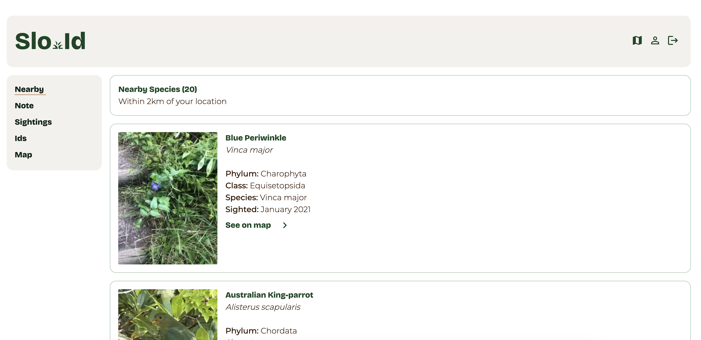

# Slo-id

A citizen science species identification app. Users capture sightings — photo, video, or audio — with location and environmental data. Sightings are enriched with species-specific form fields and promoted to identifications once confirmed by the community.
